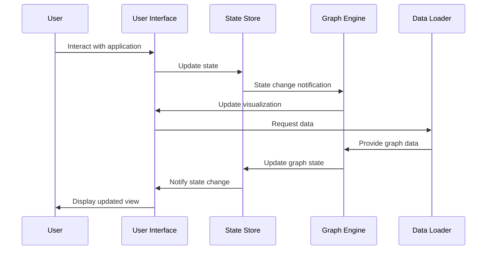

# Technical Documentation: NAS Knowledge Graph Demo

This document provides comprehensive technical documentation for developers, including architecture overview, module descriptions, data models, and extension guidelines.

## Table of Contents

1. [System Architecture](#system-architecture)
2. [Module Descriptions](#module-descriptions)
3. [Data Models](#data-models)
4. [API Reference](#api-reference)
5. [Extension Guide](#extension-guide)
6. [Performance Considerations](#performance-considerations)
7. [Security Guidelines](#security-guidelines)
8. [Development Workflow](#development-workflow)

## System Architecture

### High-Level Architecture Diagram

```mermaid
graph TB
    subgraph "Frontend Application"
        UI[User Interface Layer]
        CORE[Core Application Layer]
        DATA[Data Management Layer]
        UTILS[Utilities Layer]
    end
    
    subgraph "User Interface Components"
        UI --> GV[Graph Visualization]
        UI --> SP[Side Panel]
        UI --> CT[Control Toolbar]
        UI --> AN[Analytics Dashboard]
    end
    
    subgraph "Core Services"
        CORE --> ST[State Store]
        CORE --> GR[Graph Engine]
        CORE --> EV[Event Manager]
        CORE --> RT[Router]
    end
    
    subgraph "Data Layer"
        DATA --> DL[Data Loader]
        DATA --> VA[Validators]
        DATA --> EX[Export Engine]
        DATA --> CA[Cache Manager]
    end
    
    subgraph "External Sources"
        JSON[JSON Files]
        CSV[CSV Data]
        API[External APIs]
        FILE[Local Files]
    end
    
    DATA --> JSON
    DATA --> CSV
    DATA --> API
    DATA --> FILE
```



### Component Interaction Flow



### Technology Stack

#### Frontend Technologies
- **JavaScript (ES2020+)**: Modern language features and modules
- **D3.js**: Data visualization and manipulation
- **SVG/Canvas**: Graphics rendering
- **CSS Grid/Flexbox**: Responsive layout
- **Web Components**: Custom UI elements

#### Development Tools
- **Vite**: Fast build tool and dev server
- **Jest**: Unit testing framework
- **Cypress**: End-to-end testing
- **ESLint**: Code quality and style
- **Prettier**: Code formatting
- **Husky**: Git hooks automation

#### Performance & Monitoring
- **Web Vitals**: Performance metrics
- **Lighthouse**: Audit and optimization
- **Service Worker**: Caching and offline support

## Module Descriptions

### Core Modules

#### State Store (`src/core/store.js`)

**Purpose**: Centralized application state management with reactive updates.

```javascript
/**
 * Central state store with observable pattern
 * Manages application state and provides reactive updates
 */
class Store {
    constructor(initialState = {}) {
        this.state = { ...initialState };
        this.subscribers = new Map();
        this.history = [];
    }
    
    /**
     * Subscribe to state changes
     * @param {string|string[]} keys - Keys to watch
     * @param {Function} callback - Change handler
     * @returns {Function} Unsubscribe function
     */
    subscribe(keys, callback) { /* ... */ }
    
    /**
     * Update state and notify subscribers
     * @param {Object} updates - State updates
     */
    setState(updates) { /* ... */ }
    
    /**
     * Get current state value
     * @param {string} key - State key
     * @returns {*} State value
     */
    getState(key) { /* ... */ }
}
```

**Key Features**:
- Observable pattern for reactive programming
- Selective subscriptions (watch specific keys)
- State history for undo/redo functionality
- Performance optimizations with debouncing
- TypeScript-like type validation

#### Graph Engine (`src/core/graph.js`)

**Purpose**: Core graph data structure and manipulation engine.

```javascript
/**
 * Graph engine wrapping Graphiti library
 * Handles graph data structure and algorithms
 */
class GraphEngine {
    constructor(options = {}) {
        this.nodes = new Map();
        this.edges = new Map();
        this.layouts = new Map();
        this.algorithms = new GraphAlgorithms();
    }
    
    /**
     * Add node to graph
     * @param {Object} node - Node data
     * @returns {string} Node ID
     */
    addNode(node) { /* ... */ }
    
    /**
     * Add edge to graph
     * @param {Object} edge - Edge data
     * @returns {string} Edge ID
     */
    addEdge(edge) { /* ... */ }
    
    /**
     * Find shortest path between nodes
     * @param {string} sourceId - Source node ID
     * @param {string} targetId - Target node ID
     * @returns {Array} Path of node IDs
     */
    findPath(sourceId, targetId) { /* ... */ }
}
```

**Key Features**:
- Efficient graph data structures
- Multiple layout algorithms
- Path finding and traversal
- Graph metrics calculation
- Validation and integrity checks

### UI Components

#### Graph Visualization (`src/ui/graphView.js`)

**Purpose**: D3.js-based interactive graph rendering engine.

```javascript
/**
 * Interactive graph visualization using D3.js
 * Handles rendering, interaction, and animation
 */
class GraphView {
    constructor(containerId, options = {}) {
        this.container = d3.select(`#${containerId}`);
        this.svg = null;
        this.simulation = null;
        this.options = { ...defaultOptions, ...options };
    }
    
    /**
     * Render graph with data
     * @param {Object} graphData - Nodes and edges
     */
    render(graphData) { /* ... */ }
    
    /**
     * Update node positions with animation
     * @param {Array} nodes - Node data
     */
    updateNodes(nodes) { /* ... */ }
    
    /**
     * Handle zoom and pan interactions
     */
    setupZoom() { /* ... */ }
}
```

**Key Features**:
- Force-directed simulation
- Interactive zoom and pan
- Node and edge styling
- Selection and highlighting
- Smooth animations and transitions

#### Side Panel (`src/ui/sidePanel.js`)

**Purpose**: Information display and control interface.

```javascript
/**
 * Side panel component for details and controls
 * Tabbed interface with multiple views
 */
class SidePanel {
    constructor(containerId) {
        this.container = document.getElementById(containerId);
        this.tabs = new Map();
        this.activeTab = null;
    }
    
    /**
     * Add tab to panel
     * @param {string} id - Tab ID
     * @param {string} title - Tab title
     * @param {HTMLElement} content - Tab content
     */
    addTab(id, title, content) { /* ... */ }
    
    /**
     * Switch to tab
     * @param {string} tabId - Tab ID
     */
    switchTab(tabId) { /* ... */ }
}
```

### Services

#### Data Loader (`src/services/dataLoader.js`)

**Purpose**: Handles data loading, processing, and validation.

```javascript
/**
 * Data loading and processing service
 * Supports multiple formats and sources
 */
class DataLoader {
    constructor() {
        this.cache = new Map();
        this.validators = new Map();
        this.processors = new Map();
    }
    
    /**
     * Load data from various sources
     * @param {string|Object} source - Data source
     * @param {Object} options - Loading options
     * @returns {Promise<Object>} Processed data
     */
    async loadData(source, options = {}) { /* ... */ }
    
    /**
     * Validate data structure
     * @param {Object} data - Data to validate
     * @param {string} schema - Validation schema
     * @returns {Object} Validation result
     */
    validateData(data, schema) { /* ... */ }
}
```

### Analytics Modules

#### Charts (`src/ui/analysis/charts.js`)

**Purpose**: Creates various chart types for data analysis.

```javascript
/**
 * Chart generation for analytics
 * Supports multiple chart types using D3.js
 */
class ChartGenerator {
    /**
     * Create pie chart for node type distribution
     * @param {Array} data - Chart data
     * @param {string} containerId - Container element ID
     */
    createPieChart(data, containerId) { /* ... */ }
    
    /**
     * Create bar chart for connectivity metrics
     * @param {Array} data - Chart data
     * @param {string} containerId - Container element ID
     */
    createBarChart(data, containerId) { /* ... */ }
}
```

## Data Models

### Node Data Model

```javascript
/**
 * Node represents a concept in the knowledge graph
 */
const NodeSchema = {
    id: {
        type: 'string',
        required: true,
        unique: true,
        description: 'Unique node identifier'
    },
    label: {
        type: 'string',
        required: true,
        description: 'Human-readable node name'
    },
    type: {
        type: 'string',
        required: true,
        enum: ['hardware', 'concept', 'protocol', 'process'],
        description: 'Node category'
    },
    properties: {
        type: 'object',
        required: false,
        description: 'Additional node metadata'
    },
    position: {
        type: 'object',
        properties: {
            x: { type: 'number' },
            y: { type: 'number' }
        },
        description: 'Visual position in graph'
    },
    metadata: {
        type: 'object',
        properties: {
            created: { type: 'date' },
            modified: { type: 'date' },
            source: { type: 'string' }
        }
    }
};
```

### Edge Data Model

```javascript
/**
 * Edge represents a relationship between nodes
 */
const EdgeSchema = {
    id: {
        type: 'string',
        required: true,
        unique: true,
        description: 'Unique edge identifier'
    },
    source: {
        type: 'string',
        required: true,
        description: 'Source node ID'
    },
    target: {
        type: 'string',
        required: true,
        description: 'Target node ID'
    },
    label: {
        type: 'string',
        required: false,
        description: 'Relationship description'
    },
    type: {
        type: 'string',
        enum: ['uses', 'connects', 'implements', 'contains'],
        description: 'Relationship type'
    },
    weight: {
        type: 'number',
        min: 0,
        max: 1,
        default: 1,
        description: 'Relationship strength'
    },
    properties: {
        type: 'object',
        description: 'Additional edge metadata'
    }
};
```

### Application State Model

```javascript
/**
 * Complete application state structure
 */
const AppStateSchema = {
    graph: {
        nodes: { type: 'array', items: NodeSchema },
        edges: { type: 'array', items: EdgeSchema }
    },
    ui: {
        selectedNode: { type: 'string', nullable: true },
        selectedEdge: { type: 'string', nullable: true },
        viewMode: { 
            type: 'string',
            enum: ['graph', 'table', 'analytics'],
            default: 'graph'
        },
        sidePanel: {
            visible: { type: 'boolean', default: true },
            activeTab: { type: 'string', default: 'details' },
            width: { type: 'number', default: 300 }
        }
    },
    graphView: {
        zoom: { type: 'number', default: 1 },
        center: {
            x: { type: 'number', default: 400 },
            y: { type: 'number', default: 300 }
        },
        layout: {
            type: 'string',
            enum: ['force', 'circular', 'hierarchical', 'grid'],
            default: 'force'
        }
    },
    filters: {
        nodeTypes: { type: 'array', items: { type: 'string' } },
        searchTerm: { type: 'string', default: '' },
        dateRange: {
            start: { type: 'date', nullable: true },
            end: { type: 'date', nullable: true }
        }
    },
    loading: {
        data: { type: 'boolean', default: false },
        analysis: { type: 'boolean', default: false }
    }
};
```

## API Reference

### Core API Methods

#### Store API

```javascript
// State management
store.setState({ selectedNode: 'node-1' });
const node = store.getState('selectedNode');

// Subscriptions
const unsubscribe = store.subscribe('selectedNode', (newNode, oldNode) => {
    console.log('Node changed:', newNode);
});

// Multiple keys
store.subscribe(['selectedNode', 'selectedEdge'], (state) => {
    console.log('Selection changed:', state);
});
```

#### Graph API

```javascript
// Node operations
const nodeId = graph.addNode({
    label: 'New NAS Device',
    type: 'hardware',
    properties: { vendor: 'Synology', model: 'DS920+' }
});

// Edge operations
const edgeId = graph.addEdge({
    source: 'node-1',
    target: 'node-2',
    label: 'connects to',
    type: 'connects'
});

// Path finding
const path = graph.findPath('node-1', 'node-5');
console.log('Shortest path:', path);

// Graph metrics
const metrics = graph.calculateMetrics();
console.log('Graph density:', metrics.density);
```

#### Data Loader API

```javascript
// Load from JSON
const data = await dataLoader.loadData('./data/sample-graph.json');

// Load from CSV
const csvData = await dataLoader.loadData('./data/nodes.csv', {
    format: 'csv',
    nodeColumn: 'name',
    typeColumn: 'category'
});

// Load from URL
const remoteData = await dataLoader.loadData('https://api.example.com/graph', {
    format: 'json',
    headers: { 'Authorization': 'Bearer token' }
});
```

### Event System

```javascript
// Listen for graph events
document.addEventListener('nodeSelected', (event) => {
    console.log('Node selected:', event.detail.node);
});

// Listen for filter changes
document.addEventListener('filtersChanged', (event) => {
    console.log('Filters updated:', event.detail.filters);
});

// Custom events
const customEvent = new CustomEvent('analysisComplete', {
    detail: { results: analysisData }
});
document.dispatchEvent(customEvent);
```

## Extension Guide

### Adding New Node Types

1. **Define the node type**:
```javascript
// src/config/nodeTypes.js
export const NODE_TYPES = {
    // Existing types...
    'security': {
        color: '#9b59b6',
        icon: '🔒',
        label: 'Security Component'
    }
};
```

2. **Update validation schema**:
```javascript
// Update NodeSchema enum
type: {
    enum: ['hardware', 'concept', 'protocol', 'process', 'security']
}
```

3. **Add styling**:
```css
/* assets/styles.css */
.node-security {
    fill: #9b59b6;
    stroke: #8e44ad;
}
```

### Creating Custom Analytics

1. **Create analytics module**:
```javascript
// src/ui/analysis/customAnalytics.js
export class CustomAnalytics {
    constructor(containerId) {
        this.container = document.getElementById(containerId);
    }
    
    generateSecurityReport(nodes, edges) {
        const securityNodes = nodes.filter(n => n.type === 'security');
        // Generate custom analysis...
    }
}
```

2. **Register with main application**:
```javascript
// src/index.js
import { CustomAnalytics } from './ui/analysis/customAnalytics.js';

const customAnalytics = new CustomAnalytics('custom-analytics-container');
sidePanel.addTab('security', 'Security Analysis', customAnalytics.container);
```

### Adding New Layout Algorithms

1. **Implement layout algorithm**:
```javascript
// src/algorithms/customLayout.js
export class CustomLayout {
    constructor(options = {}) {
        this.options = options;
    }
    
    layout(nodes, edges) {
        // Implement custom positioning algorithm
        return nodes.map(node => ({
            ...node,
            x: calculateX(node),
            y: calculateY(node)
        }));
    }
}
```

2. **Register with graph engine**:
```javascript
// src/core/graph.js
import { CustomLayout } from '../algorithms/customLayout.js';

this.layouts.set('custom', new CustomLayout());
```

### Creating Data Import Plugins

1. **Implement data processor**:
```javascript
// src/services/processors/customFormat.js
export class CustomFormatProcessor {
    canProcess(data, options) {
        return options.format === 'custom';
    }
    
    async process(data, options) {
        // Convert custom format to standard graph data
        return {
            nodes: processedNodes,
            edges: processedEdges
        };
    }
}
```

2. **Register processor**:
```javascript
// src/services/dataLoader.js
import { CustomFormatProcessor } from './processors/customFormat.js';

this.processors.set('custom', new CustomFormatProcessor());
```

## Performance Considerations

### Optimization Strategies

#### Large Graph Handling
- **Level of Detail**: Show simplified view when zoomed out
- **Viewport Culling**: Only render visible nodes and edges
- **Clustering**: Group related nodes at high zoom levels
- **Progressive Loading**: Load data in chunks

#### Memory Management
```javascript
// Efficient node management
class EfficientNodeManager {
    constructor() {
        this.visibleNodes = new Set();
        this.nodePool = [];
    }
    
    getNode(id) {
        if (!this.visibleNodes.has(id)) {
            return this.nodePool.find(n => n.id === id) || null;
        }
        return this.visibleNodes.get(id);
    }
    
    releaseInvisibleNodes() {
        // Move invisible nodes to pool
        this.visibleNodes.forEach(node => {
            if (!this.isNodeVisible(node)) {
                this.nodePool.push(node);
                this.visibleNodes.delete(node.id);
            }
        });
    }
}
```

#### Rendering Optimizations
```javascript
// Debounced rendering
const debouncedRender = debounce(() => {
    graphView.render(currentData);
}, 16); // 60 FPS

// Canvas for performance-critical rendering
class CanvasRenderer {
    render(nodes, edges) {
        requestAnimationFrame(() => {
            this.drawNodes(nodes);
            this.drawEdges(edges);
        });
    }
}
```

### Performance Monitoring

```javascript
// Performance tracking
class PerformanceTracker {
    static measure(name, fn) {
        const start = performance.now();
        const result = fn();
        const end = performance.now();
        
        console.log(`${name}: ${end - start}ms`);
        return result;
    }
    
    static async measureAsync(name, asyncFn) {
        const start = performance.now();
        const result = await asyncFn();
        const end = performance.now();
        
        console.log(`${name}: ${end - start}ms`);
        return result;
    }
}

// Usage
const data = await PerformanceTracker.measureAsync('Data Loading', () => 
    dataLoader.loadData(source)
);
```

## Security Guidelines

### Input Validation

```javascript
// Sanitize user inputs
function sanitizeInput(input) {
    if (typeof input !== 'string') return '';
    
    return input
        .replace(/<script\b[^<]*(?:(?!<\/script>)<[^<]*)*<\/script>/gi, '')
        .replace(/[<>]/g, '')
        .trim();
}

// Validate graph data
function validateGraphData(data) {
    const schema = {
        nodes: { type: 'array', required: true },
        edges: { type: 'array', required: true }
    };
    
    return validator.validate(data, schema);
}
```

### Safe Data Processing

```javascript
// Safe JSON parsing
function safeJSONParse(jsonString) {
    try {
        return JSON.parse(jsonString);
    } catch (error) {
        console.error('Invalid JSON:', error);
        return null;
    }
}

// Content Security Policy headers
const CSP_HEADERS = {
    "default-src": "'self'",
    "script-src": "'self'",
    "style-src": "'self' 'unsafe-inline'",
    "img-src": "'self' data:",
    "connect-src": "'self'"
};
```

## Development Workflow

### Project Setup

```bash
# Clone repository
git clone https://github.com/USERNAME/nas-knowledge-graph-demo.git
cd nas-knowledge-graph-demo

# Install dependencies
npm install

# Set up development environment
npm run prepare

# Start development server
npm run dev
```

### Code Quality

```bash
# Linting
npm run lint
npm run lint:fix

# Formatting
npm run format
npm run format:check

# Testing
npm run test
npm run test:watch
npm run test:coverage
```

### Build and Deployment

```bash
# Development build
npm run build

# Production build
npm run build:prod

# Preview build
npm run preview

# Deploy to GitHub Pages
git push origin main  # Automatic deployment via GitHub Actions
```

### Debugging Tools

```javascript
// Debug mode utilities
if (process.env.NODE_ENV === 'development') {
    window.debugGraph = graph;
    window.debugStore = store;
    window.debugUtils = {
        logState: () => console.log(store.state),
        logGraph: () => console.log(graph.toJSON()),
        performance: PerformanceTracker
    };
}
```

---

*For additional technical support, see [troubleshooting.md](troubleshooting.md) or contact the development team.*
